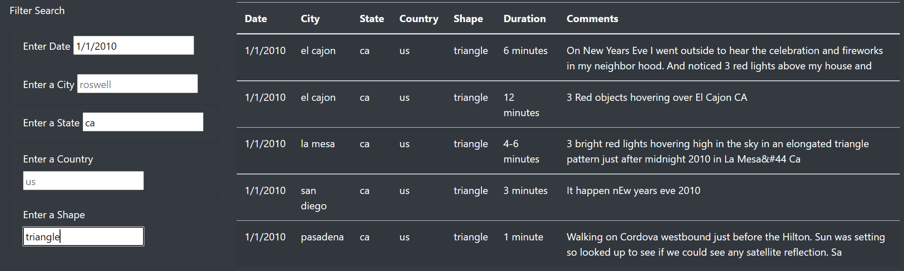

# UFOs-Challenge

## Project Overview 
A webpage was created to pull in UFO data that consisted of a list of JavaScript objects. The UFO data was used to create a table with the capability to be filtered. Originally, only the date could be filtered via a filter button that would update the table based on the user's date input. The code was refactored to include a filter option for additional ID's (city, state, country, and shape). D3 was used to listen to an event for a change in the filter elements and filter the table accordingly. 

## Results

### How the Webpage Works
When the webpage originally loads, all UFO data is loaded into the table. On the left-hand side of the image, the user can input a date, city, state, country, and/or shape. When the user presses "enter" or clicks outside of the "form", the table on the right-hand side gets filtered based on the user input for each element and element value that was entered. In the example image above, "1/1/2010" was entered as the date, "ca" was entered as the state, and "triangle" was entered as the shape. As a result, the table is filtered for these input. 

### The Code Behind the Webpage
The code uses D3 to determine which element was changed (whether it was the date, city, state, country, and/or shape), what the value was changed to (essentially the user input), and what the id is associated with each element that was changed (this id is created from the index.html file). If a filter value was entered, it adds the filterId and value to a filters variable as a key:value pair. Otherwise, it would clear that filter from the filters object. The code then loops through each item within the filters variable and keeps any data that matches the filter values. The table is then created (filtered) based on this filtered data. 

## Summary
### Drawback
One drawback of this new design is that the element value or user input has to match exactly with the data. For examples:
- All the states are in lower-case; the element value cannot contain any upper-case. 
- The user needs to know how a city is spelled. 
- The user can only enter only one format of a date. Even though all incidents occur in January of 2010. If there were additional months or years, the table cannot be filtered by months or years.

### Recommendations
The following recommendations is to address the drawbacks above:
- Allow the element value or user input to not be case-sensitive. Such as ignoring whether the element value or user input is upper- or lower-case. Although all city, state, and country date are in lower-case, this may not always be the case if additional data is introduced. 
- Update the filtering process to filter as you type. For example, if the user starts to type "b" in the city element, then it would automatically start filtering for all cities that start with the letter "b". If the user then types "e", then it would automatically start filtering for all cities that start with "be". This would help the user if they are not completely familiar with the whole dataset such as the spelling of certain cities.
- Allow the date filter to be able to filter for months and years if additional data is introduced. 